Mapping intermittency: train, test and application of models
================
Soares et al. (2025)

``` r
pacman::p_load('Boruta','caret', 'doSNOW', 'dplyr','forcats', 'ggplot2','ggpubr','Metrics','randomForest', 'raster', 'reshape')
```

# Overview

This document presents the training and evaluation of three Random
Forest (RF) classification models developed to predict riverbed water
conditions across different spatial and temporal resolutions. Each model
corresponds to a different remote sensing data source:

- **Model a** uses Sentinel-2 imagery, providing moderate spatial but
  high temporal coverage;

- **Model b** uses PlanetScope data, offering higher spatial detail with
  lower revisit frequency;

- **Model c** uses only hydrological data as predictor so it uses all
  available UAV (drone) imagery.

For each dataset, the available observations (UAV-derived classification
of water occurrence) were split into training (75%) and testing (25%)
subsets to evaluate model performance. RF models were tuned and trained
independently, using candidate predictor variables derived from spectral
indices and surface characteristics. The following subsections describe
the training process and outputs for each model. We initiate using all
candidate predictors and after that we use the recursive feature
elimination tool (RFE) to select the most important predictors for each
model. We then train models with only the selected predictor and
evaluate them through application to the whole river.

**Reproducibility note:** Some numerical results (e.g., accuracy values,
model outputs) may differ slightly from the figures and tables reported
in the associated publication. These differences are due to the
stochastic nature of random forest training and cross-validation, as
well as differences in software versions or system environments. Setting
the random seeds in the code ensures that results are consistent within
a given run.

**Class label note:** One classification class is labeled differently in
the code (Partially) than in the publication (Transition). This change
was made for simplicity in the code and does not affect the
interpretation of results.

## Model training and testing: river sections

This section describes the training and evaluation of Random Forest
models developed with all available candidate predictors. Each model
corresponds to a distinct data source and spatial resolution.

### Model a: Sentinel

Model a uses Sentinel-based inputs to classify water conditions in the
river. All models are trained using field observations and spectral
indices, applying a 75/25% split between training and testing data.

``` r
# Load observational dataset for Model a (Sentinel)
# The first column is removed as it contains redundant index information
data_obs_Sent <- read.csv("Input/data_input_modela.csv")[,-1]
head(data_obs_Sent)
```

    ##      X Units Month Section  WC WC_int elev_mean slope_mean contr_max_km2
    ## 1 3179 26450     6      BN Dry      1    564.83       0.01      117.7163
    ## 2 3185 26500     6      BN Dry      1    564.58       0.01      117.7284
    ## 3 3191 26550     6      BN Dry      1    564.74       0.01      117.7900
    ## 4 3197 26600     6      BN Dry      1    565.15       0.02      117.7931
    ## 5 3203 26650     6      BN Dry      1    564.02       0.01      117.8050
    ## 6 3209 26700     6      BN Wet      4    562.77       0.00      117.8092
    ##   stream_sum recur_mean occur_mean ext_sum Dist_fromLast Dist_toNext Dam
    ## 1          8   39.11111   13.66667       9      2336.451    297.4536   0
    ## 2          7   41.00000   14.83333      12      2369.916    255.2302   0
    ## 3          6   44.77778   16.00000       9      2409.621    211.1149   0
    ## 4          6   49.30000   18.60000      10      2454.105    165.5558   0
    ## 5          6   49.55556   21.11111       9      2503.242    116.6920   0
    ## 6          7   66.00000   31.40000      10         0.000      0.0000   1
    ##   mapbio_maj mb_forest_ mb_savan_m mb_grass_m mb_past_me mb_agri_me mb_water_m
    ## 1          3  1.0000000          0          0          0          0  0.0000000
    ## 2          3  1.0000000          0          0          0          0  0.0000000
    ## 3          3  1.0000000          0          0          0          0  0.0000000
    ## 4          3  1.0000000          0          0          0          0  0.0000000
    ## 5          3  0.7777778          0          0          0          0  0.2222222
    ## 6         33  0.2222222          0          0          0          0  0.7777778
    ##   mb_crops_m  acm30    api30  Level Vol_hm3 dV_hm3 SENTndvi_mean SENTndwi_mean
    ## 1          0 77.978 5.041834 441.84    5.57  -0.01     0.2209923   -0.19214043
    ## 2          0 77.978 5.041834 441.84    5.57  -0.01     0.2366081   -0.20087194
    ## 3          0 77.978 5.041834 441.84    5.57  -0.01     0.2613496   -0.21690717
    ## 4          0 77.978 5.041834 441.84    5.57  -0.01     0.2701145   -0.22401476
    ## 5          0 77.978 5.041834 441.84    5.57  -0.01     0.2516057   -0.21319034
    ## 6          0 77.978 5.041834 441.84    5.57  -0.01     0.1215522   -0.09866108
    ##   SENTswi_mean SENTndmi_re_mean SENTndmi_nir_mean SENTmndwi_mean dw_majorit
    ## 1   -0.2619573     -0.051952238       -0.10996064     -0.2961109          5
    ## 2   -0.2610732     -0.038047746       -0.09716495     -0.2925577          5
    ## 3   -0.2441073     -0.003727894       -0.06032722     -0.2737629          1
    ## 4   -0.2323466      0.015184108       -0.04069009     -0.2624165          1
    ## 5   -0.2170653      0.013855802       -0.03961527     -0.2506984          1
    ## 6   -0.1383617     -0.021445988       -0.06631402     -0.1636074          1
    ##   bare_freq built_freq crops_freq flooded_freq grass_freq shrubs_freq
    ## 1         0          0          0            0          0   1.0000000
    ## 2         0          0          0            0          0   0.8481013
    ## 3         0          0          0            0          0   0.3333333
    ## 4         0          0          0            0          0   0.0000000
    ## 5         0          0          0            0          0   0.0000000
    ## 6         0          0          0            0          0   0.1666667
    ##   trees_freq water_freq
    ## 1  0.0000000  0.0000000
    ## 2  0.1518987  0.0000000
    ## 3  0.6666667  0.0000000
    ## 4  1.0000000  0.0000000
    ## 5  1.0000000  0.0000000
    ## 6  0.4615385  0.3717949

``` r
# Set a random seed for reproducibility
set.seed(100)

# Split the dataset into training (75%) and testing (25%) sets
# The split is stratified based on the 5th column of 'data_obs_Sent'
index <- createDataPartition(data_obs_Sent[,5], p=0.75, list=FALSE)

# Select the predictor variables (excluding columns 1 to 6) for training and testing
x_train_a <- data_obs_Sent[index, -c(1:6)]
x_test_a  <- data_obs_Sent[-index, -c(1:6)]

# Select the response variable (5th column) and convert it to a factor
y_train_a <- as.factor(data_obs_Sent[index, 5])
y_test_a  <- as.factor(data_obs_Sent[-index, 5])
```

``` r
# Estimate a suitable mtry value (number of variables tried at each split)
sqrt(ncol(x_train_a))
```

    ## [1] 6.164414

``` r
# Train Random Forest model with tuned parameters
set.seed(1000)
rf_Sentx <- randomForest(
                        x = x_train_a,
                        y = y_train_a,
                        ntree = 500,       # number of trees
                        mtry = 6,          # number of predictors at each split
                        importance = TRUE, # compute variable importance
                        proximity = TRUE   # store proximity matrix
                        )

# Display model summary
print(rf_Sentx)
```

    ## 
    ## Call:
    ##  randomForest(x = x_train_a, y = y_train_a, ntree = 500, mtry = 6,      importance = TRUE, proximity = TRUE) 
    ##                Type of random forest: classification
    ##                      Number of trees: 500
    ## No. of variables tried at each split: 6
    ## 
    ##         OOB estimate of  error rate: 20.26%
    ## Confusion matrix:
    ##           Dry NotDet Partially Wet class.error
    ## Dry       210     24         0   8   0.1322314
    ## NotDet     30     91         1   1   0.2601626
    ## Partially   4      1         0   1   1.0000000
    ## Wet        16      6         0  61   0.2650602

### Model b: Planetscope

Model b uses PlanetScope imagery to classify water condition classes
along the river. The model is trained using field observations and
PlanetScope-derived spectral indices.

``` r
# Load observational dataset for Model b (PlanetScope)
# The first column is removed as it contains redundant index information
data_obs_PS <- read.csv("Input/data_input_modelb.csv")[,-1]
head(data_obs_PS)
```

    ##      X Units Month Section     WC WC_int elev_mean slope_mean contr_max_km2
    ## 1 3177 26450     4      BN NotDet      2    564.83       0.01      117.7163
    ## 2 3179 26450     6      BN    Dry      1    564.83       0.01      117.7163
    ## 3 3183 26500     4      BN NotDet      2    564.58       0.01      117.7284
    ## 4 3185 26500     6      BN    Dry      1    564.58       0.01      117.7284
    ## 5 3189 26550     4      BN NotDet      2    564.74       0.01      117.7900
    ## 6 3191 26550     6      BN    Dry      1    564.74       0.01      117.7900
    ##   stream_sum recur_mean occur_mean ext_sum Dist_fromLast Dist_toNext Dam
    ## 1          8   39.11111   13.66667       9      2336.451    297.4536   0
    ## 2          8   39.11111   13.66667       9      2336.451    297.4536   0
    ## 3          7   41.00000   14.83333      12      2369.916    255.2302   0
    ## 4          7   41.00000   14.83333      12      2369.916    255.2302   0
    ## 5          6   44.77778   16.00000       9      2409.621    211.1149   0
    ## 6          6   44.77778   16.00000       9      2409.621    211.1149   0
    ##   mapbio_maj mb_forest_ mb_savan_m mb_grass_m mb_past_me mb_agri_me mb_water_m
    ## 1          3          1          0          0          0          0          0
    ## 2          3          1          0          0          0          0          0
    ## 3          3          1          0          0          0          0          0
    ## 4          3          1          0          0          0          0          0
    ## 5          3          1          0          0          0          0          0
    ## 6          3          1          0          0          0          0          0
    ##   mb_crops_m   acm30     api30  Level Vol_hm3 dV_hm3 PSndvi_mean PSndwi_mean
    ## 1          0 134.366 48.933429 441.95    5.70   0.00   0.7915066  -0.6689139
    ## 2          0  77.978  5.041834 441.84    5.57  -0.01   0.5544926  -0.5906996
    ## 3          0 134.366 48.933429 441.95    5.70   0.00   0.7783583  -0.6626292
    ## 4          0  77.978  5.041834 441.84    5.57  -0.01   0.5826700  -0.6061324
    ## 5          0 134.366 48.933429 441.95    5.70   0.00   0.7410407  -0.6462722
    ## 6          0  77.978  5.041834 441.84    5.57  -0.01   0.6165910  -0.6202843

``` r
# Split the dataset into training (75%) and testing (25%) subsets
set.seed(100)
index <- createDataPartition(data_obs_PS[,5], p = 0.75, list = FALSE)

# Define predictor variables (PlanetScope indices and derived metrics)
x_train_b <- data_obs_PS[index, -c(1:6)]
x_test_b  <- data_obs_PS[-index, -c(1:6)]

# Define response variable (observed water condition)
y_train_b <- as.factor(data_obs_PS[index, 5])
y_test_b  <- as.factor(data_obs_PS[-index, 5])
```

``` r
# Estimate a suitable mtry value (number of predictors tried at each split)
sqrt(ncol(x_train_b))
```

    ## [1] 5

``` r
# Train Random Forest model with tuned parameters
set.seed(1000)
rf_PSx <- randomForest(
                       x = x_train_b,
                       y = y_train_b,
                       ntree = 500,        # number of trees
                       mtry = 5,           # number of predictors at each split
                       importance = TRUE,  # compute variable importance
                       proximity = TRUE    # store proximity matrix
                       )

# Display model summary
print(rf_PSx)
```

    ## 
    ## Call:
    ##  randomForest(x = x_train_b, y = y_train_b, ntree = 500, mtry = 5,      importance = TRUE, proximity = TRUE) 
    ##                Type of random forest: classification
    ##                      Number of trees: 500
    ## No. of variables tried at each split: 5
    ## 
    ##         OOB estimate of  error rate: 22.83%
    ## Confusion matrix:
    ##           Dry NotDet Partially Wet class.error
    ## Dry       224     31         0  11   0.1578947
    ## NotDet     41    137         2   3   0.2513661
    ## Partially   4      7         6   3   0.7000000
    ## Wet        16     12         4  86   0.2711864

### Model c: Precipitation

Model c uses hydrological variables to classify water conditions along
the river. Since the temporal resolution for this data is higher, we can
use all UAV (drone) imagery.

``` r
# Load observational dataset for Model c (UAV imagery)
# The first column is removed as it contains redundant indexing information
data_obs_UAV <- read.csv("Input/data_input_modelc.csv")[,-1]
head(data_obs_UAV)
```

    ##      X Units Month Section     WC WC_int elev_mean slope_mean contr_max_km2
    ## 1 3177 26450     4      BN NotDet      2    564.83       0.01      117.7163
    ## 2 3179 26450     6      BN    Dry      1    564.83       0.01      117.7163
    ## 3 3183 26500     4      BN NotDet      2    564.58       0.01      117.7284
    ## 4 3185 26500     6      BN    Dry      1    564.58       0.01      117.7284
    ## 5 3189 26550     4      BN NotDet      2    564.74       0.01      117.7900
    ## 6 3191 26550     6      BN    Dry      1    564.74       0.01      117.7900
    ##   stream_sum recur_mean occur_mean ext_sum Dist_fromLast Dist_toNext Dam
    ## 1          8   39.11111   13.66667       9      2336.451    297.4536   0
    ## 2          8   39.11111   13.66667       9      2336.451    297.4536   0
    ## 3          7   41.00000   14.83333      12      2369.916    255.2302   0
    ## 4          7   41.00000   14.83333      12      2369.916    255.2302   0
    ## 5          6   44.77778   16.00000       9      2409.621    211.1149   0
    ## 6          6   44.77778   16.00000       9      2409.621    211.1149   0
    ##   mapbio_maj mb_forest_ mb_savan_m mb_grass_m mb_past_me mb_agri_me mb_water_m
    ## 1          3          1          0          0          0          0          0
    ## 2          3          1          0          0          0          0          0
    ## 3          3          1          0          0          0          0          0
    ## 4          3          1          0          0          0          0          0
    ## 5          3          1          0          0          0          0          0
    ## 6          3          1          0          0          0          0          0
    ##   mb_crops_m   acm30     api30  Level Vol_hm3 dV_hm3
    ## 1          0 134.366 48.933429 441.95    5.70   0.00
    ## 2          0  77.978  5.041834 441.84    5.57  -0.01
    ## 3          0 134.366 48.933429 441.95    5.70   0.00
    ## 4          0  77.978  5.041834 441.84    5.57  -0.01
    ## 5          0 134.366 48.933429 441.95    5.70   0.00
    ## 6          0  77.978  5.041834 441.84    5.57  -0.01

``` r
# Split the dataset into training (75%) and testing (25%) subsets
set.seed(100)
index <- createDataPartition(data_obs_UAV[,5], p = 0.75, list = FALSE)

# Define predictor variables (drone-derived indices and metrics)
x_train_c <- data_obs_UAV[index, -c(1:6)]
x_test_c  <- data_obs_UAV[-index, -c(1:6)]

# Define response variable (observed water condition)
y_train_c <- as.factor(data_obs_UAV[index, 5])
y_test_c  <- as.factor(data_obs_UAV[-index, 5])
```

``` r
# Estimate a suitable mtry value (number of predictors tried at each split)
sqrt(ncol(x_train_c))
```

    ## [1] 4.795832

``` r
# Train Random Forest model with tuned parameters
set.seed(1000)
rf_Dronex <- randomForest(
                        x = x_train_c,
                        y = y_train_c,
                        ntree = 500,        # number of trees
                        mtry = 5,           # number of predictors at each split
                        importance = TRUE,  # compute variable importance
                        proximity = TRUE    # store proximity matrix
                        )

# Display model summary
print(rf_Dronex)
```

    ## 
    ## Call:
    ##  randomForest(x = x_train_c, y = y_train_c, ntree = 500, mtry = 5,      importance = TRUE, proximity = TRUE) 
    ##                Type of random forest: classification
    ##                      Number of trees: 500
    ## No. of variables tried at each split: 5
    ## 
    ##         OOB estimate of  error rate: 18.39%
    ## Confusion matrix:
    ##           Dry NotDet Partially Wet class.error
    ## Dry       238     44         1   8   0.1821306
    ## NotDet     38    346         7   8   0.1328321
    ## Partially   2     16        25  11   0.5370370
    ## Wet        17     11         6 141   0.1942857

## Recursive Feature Elimination (RFE)

To identify the most informative predictor variables for each model, we
applied Recursive Feature Elimination (RFE) with Random Forests as the
underlying learning algorithm. The RFE procedure iteratively evaluates
model performance while removing the least important variables,
resulting in an optimized subset of predictors that balances model
accuracy and complexity.

### Model a: Sentinel

``` r
# Define the RFE control parameters:
# - rfFuncs: use random forest for feature ranking
# - repeatedcv: repeated cross-validation to ensure stability
# - repeated cross-validation (5 repeats) to ensure robust performance estimates
ctrl <- rfeControl(functions = rfFuncs,
                   method = "repeatedcv",
                   repeats = 5,
                   verbose = FALSE)

# Define the subset sizes (number of predictors to test at each iteration)
subsets <- c(1:5, seq(6, 38, 2))

# Run RFE on the Sentinel-2 model training set
rfProfile <- rfe(x = x_train_a, 
                 y = y_train_a,
                 sizes = subsets,
                 rfeControl = ctrl)

# Print model selection results
print(rfProfile)
```

    ## 
    ## Recursive feature selection
    ## 
    ## Outer resampling method: Cross-Validated (10 fold, repeated 5 times) 
    ## 
    ## Resampling performance over subset size:
    ## 
    ##  Variables Accuracy  Kappa AccuracySD KappaSD Selected
    ##          1   0.5110 0.1744    0.06191 0.10740         
    ##          2   0.5668 0.2758    0.07084 0.11907         
    ##          3   0.5693 0.2772    0.06112 0.10743         
    ##          4   0.6003 0.3335    0.10898 0.18781         
    ##          5   0.7951 0.6619    0.05093 0.08186         
    ##          6   0.8070 0.6785    0.05973 0.10246        *
    ##          8   0.8025 0.6721    0.05870 0.10112         
    ##         10   0.7938 0.6560    0.05635 0.09878         
    ##         12   0.7933 0.6539    0.05253 0.09237         
    ##         14   0.7919 0.6509    0.05336 0.09413         
    ##         16   0.7950 0.6572    0.04845 0.08464         
    ##         18   0.7914 0.6504    0.05180 0.09212         
    ##         20   0.7893 0.6466    0.05379 0.09624         
    ##         22   0.7862 0.6408    0.05372 0.09428         
    ##         24   0.7905 0.6477    0.05889 0.10524         
    ##         26   0.7954 0.6565    0.05372 0.09615         
    ##         28   0.8021 0.6682    0.05169 0.09295         
    ##         30   0.7990 0.6628    0.05682 0.10041         
    ##         32   0.7972 0.6605    0.05415 0.09530         
    ##         34   0.7977 0.6607    0.05754 0.10094         
    ##         36   0.8047 0.6722    0.05585 0.09968         
    ##         38   0.8007 0.6653    0.05323 0.09625         
    ## 
    ## The top 5 variables (out of 6):
    ##    Dist_fromLast, contr_max_km2, Dist_toNext, elev_mean, SENTmndwi_mean

``` r
# Inspect the best-performing fitted model
rfProfile$fit
```

    ## 
    ## Call:
    ##  randomForest(x = x, y = y, importance = TRUE) 
    ##                Type of random forest: classification
    ##                      Number of trees: 500
    ## No. of variables tried at each split: 2
    ## 
    ##         OOB estimate of  error rate: 19.38%
    ## Confusion matrix:
    ##           Dry NotDet Partially Wet class.error
    ## Dry       206     28         1   7   0.1487603
    ## NotDet     25     94         1   3   0.2357724
    ## Partially   3      1         0   2   1.0000000
    ## Wet        10      6         1  66   0.2048193

``` r
# Save the RFE output for later use
RFE_rfSent <- rfProfile
```

### Model b: Planetscope

``` r
# Define the RFE control parameters:
# - rfFuncs: random forest functions for ranking predictors
# - repeatedcv: repeated cross-validation to ensure stability
# - repeats = 5: number of CV repetitions
ctrl <- rfeControl(functions = rfFuncs,
                   method = "repeatedcv",
                   repeats = 5,
                   verbose = FALSE)

# Define the range of subset sizes (number of predictors tested)
subsets <- c(1:5, seq(6, 25, 2))

# Run the RFE algorithm on the PlanetScope model training data
rfProfile <- rfe(x = x_train_b, 
                 y = y_train_b,
                 sizes = subsets,
                 rfeControl = ctrl)

# Print summary of RFE performance and selected features
print(rfProfile)
```

    ## 
    ## Recursive feature selection
    ## 
    ## Outer resampling method: Cross-Validated (10 fold, repeated 5 times) 
    ## 
    ## Resampling performance over subset size:
    ## 
    ##  Variables Accuracy  Kappa AccuracySD KappaSD Selected
    ##          1   0.5428 0.2974    0.06377 0.09979         
    ##          2   0.5778 0.3476    0.06372 0.10265         
    ##          3   0.6008 0.3834    0.07936 0.12579         
    ##          4   0.6436 0.4498    0.10708 0.16828         
    ##          5   0.7633 0.6346    0.05034 0.07986         
    ##          6   0.7619 0.6319    0.04317 0.06875         
    ##          8   0.7724 0.6472    0.04792 0.07639         
    ##         10   0.7792 0.6577    0.04815 0.07749        *
    ##         12   0.7730 0.6473    0.04797 0.07836         
    ##         14   0.7716 0.6444    0.04744 0.07841         
    ##         16   0.7723 0.6461    0.04757 0.07809         
    ##         18   0.7740 0.6485    0.04975 0.08247         
    ##         20   0.7757 0.6513    0.05428 0.08931         
    ##         22   0.7747 0.6500    0.04877 0.07955         
    ##         24   0.7720 0.6445    0.05112 0.08454         
    ##         25   0.7730 0.6469    0.05156 0.08462         
    ## 
    ## The top 5 variables (out of 10):
    ##    Dist_fromLast, contr_max_km2, Dist_toNext, elev_mean, PSndvi_mean

``` r
# Inspect the best-performing model fit
rfProfile$fit
```

    ## 
    ## Call:
    ##  randomForest(x = x, y = y, importance = TRUE) 
    ##                Type of random forest: classification
    ##                      Number of trees: 500
    ## No. of variables tried at each split: 3
    ## 
    ##         OOB estimate of  error rate: 21.98%
    ## Confusion matrix:
    ##           Dry NotDet Partially Wet class.error
    ## Dry       226     32         0   8   0.1503759
    ## NotDet     41    135         2   5   0.2622951
    ## Partially   4      3         8   5   0.6000000
    ## Wet        16     10         3  89   0.2457627

``` r
# Save the RFE output for later reference
RFE_rfPS <- rfProfile
```

### Model c: Precipitation

``` r
# Define the RFE control parameters:
# - rfFuncs: random forest functions for variable importance and ranking
# - repeatedcv: repeated cross-validation to ensure robust feature selection
# - repeats = 5: number of cross-validation repetitions
ctrl <- rfeControl(functions = rfFuncs,
                   method = "repeatedcv",
                   repeats = 5,
                   verbose = FALSE)

# Define the range of subset sizes (number of predictors to evaluate)
subsets <- c(1:5, seq(6, 25, 2))

# Apply Recursive Feature Elimination (RFE) using Random Forest
rfProfile <- rfe(x = x_train_c, 
                 y = y_train_c,
                 sizes = subsets,
                 rfeControl = ctrl)

# Print summary of the RFE process, including the optimal subset of predictors
print(rfProfile)
```

    ## 
    ## Recursive feature selection
    ## 
    ## Outer resampling method: Cross-Validated (10 fold, repeated 5 times) 
    ## 
    ## Resampling performance over subset size:
    ## 
    ##  Variables Accuracy  Kappa AccuracySD KappaSD Selected
    ##          1   0.5693 0.3539    0.04280 0.06366         
    ##          2   0.5667 0.3490    0.04799 0.07207         
    ##          3   0.5730 0.3575    0.04206 0.06474         
    ##          4   0.5708 0.3548    0.04739 0.07252         
    ##          5   0.7764 0.6648    0.08929 0.13472         
    ##          6   0.8033 0.7047    0.04679 0.06925         
    ##          8   0.7981 0.6951    0.04235 0.06331         
    ##         10   0.8037 0.7049    0.04019 0.05973         
    ##         12   0.8001 0.6991    0.03919 0.05905         
    ##         14   0.8027 0.7027    0.03744 0.05618         
    ##         16   0.8066 0.7090    0.03899 0.05857         
    ##         18   0.8016 0.7013    0.04348 0.06525         
    ##         20   0.8072 0.7095    0.04021 0.06085        *
    ##         22   0.8053 0.7065    0.04034 0.06106         
    ##         23   0.8033 0.7033    0.03976 0.05964         
    ## 
    ## The top 5 variables (out of 20):
    ##    contr_max_km2, Dist_fromLast, Dist_toNext, elev_mean, api30

``` r
# Inspect details of the best-performing model fit
rfProfile$fit
```

    ## 
    ## Call:
    ##  randomForest(x = x, y = y, importance = TRUE) 
    ##                Type of random forest: classification
    ##                      Number of trees: 500
    ## No. of variables tried at each split: 4
    ## 
    ##         OOB estimate of  error rate: 20.24%
    ## Confusion matrix:
    ##           Dry NotDet Partially Wet class.error
    ## Dry       231     49         1  10   0.2061856
    ## NotDet     40    343         8   8   0.1403509
    ## Partially   2     17        22  13   0.5925926
    ## Wet        18     13         7 137   0.2171429

``` r
# Store the RFE output for later use in model selection and training
RFE_rfDrone <- rfProfile
```

### Export rfe Profile: models a, b and c

After running RFE for each model, we compared their performance by
plotting accuracy against the number of selected predictors. This allows
a visual assessment of how model complexity (number of variables)
influences classification accuracy across different input datasets.

``` r
# Extract RFE results (number of predictors and accuracy) for each model
rfe_sent_result <- RFE_rfSent$results[1:2]
rfe_sent_result$model <- "Model a"

rfe_ps_result <- RFE_rfPS$results[1:2]
rfe_ps_result$model <- "Model b"

rfe_dr_result <- RFE_rfDrone$results[1:2]
rfe_dr_result$model <- "Model c"

# Combine results from all models into one dataframe
rfe_result <- rbind(rfe_ps_result, rfe_sent_result, rfe_dr_result)
rfe_result$model <- factor(rfe_result$model, levels=c("Model a","Model b","Model c"))
rfe_result$Accuracy <- rfe_result$Accuracy * 100  # Convert accuracy to percentage

# Plot accuracy vs. number of predictors for each model
ggplot(rfe_result, aes(x = Variables, y = Accuracy, color = model)) +
  geom_line() +
  geom_point(aes(shape = model), size = 2) +
  ylab("Overall accuracy (%)") +
  xlab("Number of predictors") +
  scale_x_continuous(expand = c(0.01, 0), breaks = seq(0, 50, 5), limits = c(0, 40)) +
  scale_y_continuous(limits = c(50, 82)) +
  scale_color_manual(values = c('black', '#bdbdbd', '#636363')) +
  theme_classic() +
  theme(
    legend.title = element_blank(),
    legend.position = c(0.8, 0.2),
    text = element_text(size = 16, family = "serif")
  )
```

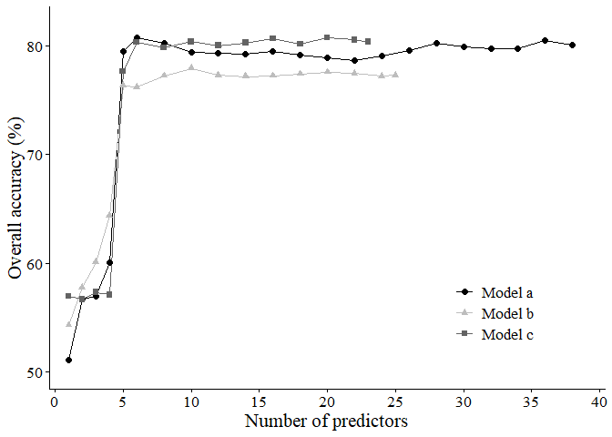<!-- -->

## Selected classification models: train new models with most important predictors

Using the most important predictors identified through RFE, we retrained
each model to improve efficiency and interpretability. The following
code shows the training process for Model a (Sentinel) using the reduced
predictor set.

### Model a: Sentinel

``` r
# Keep only the selected predictors identified by RFE
data_obs_Sent <- data_obs_Sent[,-c(8,10:13,16:34,36:44)]
colnames(data_obs_Sent)
```

    ##  [1] "X"              "Units"          "Month"          "Section"       
    ##  [5] "WC"             "WC_int"         "elev_mean"      "contr_max_km2" 
    ##  [9] "Dist_fromLast"  "Dist_toNext"    "SENTmndwi_mean"

``` r
# Split dataset into training (75%) and testing (25%) subsets
set.seed(100)
index <- createDataPartition(data_obs_Sent[,5], p=0.75, list=FALSE)
x_train_a <- data_obs_Sent[index,-c(1:6)]
x_test_a  <- data_obs_Sent[-index,-c(1:6)]
y_train_a <- as.factor(data_obs_Sent[index,5])
y_test_a  <- as.factor(data_obs_Sent[-index,5])

# Train Random Forest using only the selected predictors
set.seed(100)
rf_selSent5x <- randomForest(
  x = x_train_a, y = y_train_a,
  ntree = 500,
  mtry = 2,
  importance = TRUE,
  proximity = TRUE,
  keep.inbag = TRUE
)

print(rf_selSent5x)
```

    ## 
    ## Call:
    ##  randomForest(x = x_train_a, y = y_train_a, ntree = 500, mtry = 2,      importance = TRUE, proximity = TRUE, keep.inbag = TRUE) 
    ##                Type of random forest: classification
    ##                      Number of trees: 500
    ## No. of variables tried at each split: 2
    ## 
    ##         OOB estimate of  error rate: 20.48%
    ## Confusion matrix:
    ##           Dry NotDet Partially Wet class.error
    ## Dry       206     29         1   6   0.1487603
    ## NotDet     28     89         1   5   0.2764228
    ## Partially   2      1         0   3   1.0000000
    ## Wet         8      8         1  66   0.2048193

### Model b: Planetscope

``` r
# Keep only the selected predictors identified by RFE
data_obs_PS <- data_obs_PS[,-c(8,10:13,16:29,31)]
colnames(data_obs_PS)
```

    ##  [1] "X"             "Units"         "Month"         "Section"      
    ##  [5] "WC"            "WC_int"        "elev_mean"     "contr_max_km2"
    ##  [9] "Dist_fromLast" "Dist_toNext"   "PSndvi_mean"

``` r
# Split dataset into training (75%) and testing (25%) subsets
set.seed(100)
index <- createDataPartition(data_obs_PS[,5], p=0.75, list=FALSE)
x_train_b <- data_obs_PS[index,-c(1:6)]
x_test_b  <- data_obs_PS[-index,-c(1:6)]
y_train_b <- as.factor(data_obs_PS[index,5])
y_test_b  <- as.factor(data_obs_PS[-index,5])

# Train Random Forest using only the selected predictors
set.seed(1000)
rf_PS5x <- randomForest(
  x = x_train_b, y = y_train_b,
  ntree = 500,
  mtry = 2,
  importance = TRUE,
  proximity = TRUE
)

print(rf_PS5x)
```

    ## 
    ## Call:
    ##  randomForest(x = x_train_b, y = y_train_b, ntree = 500, mtry = 2,      importance = TRUE, proximity = TRUE) 
    ##                Type of random forest: classification
    ##                      Number of trees: 500
    ## No. of variables tried at each split: 2
    ## 
    ##         OOB estimate of  error rate: 22.32%
    ## Confusion matrix:
    ##           Dry NotDet Partially Wet class.error
    ## Dry       222     34         2   8   0.1654135
    ## NotDet     36    134         3  10   0.2677596
    ## Partially   6      4         8   2   0.6000000
    ## Wet        12     12         2  92   0.2203390

### Model c: Precipitation

``` r
# Keep only the selected predictors identified by RFE
data_obs_UAV <- data_obs_UAV[,-c(8,10,11:13,16:25,27:30)]
colnames(data_obs_UAV)
```

    ##  [1] "X"             "Units"         "Month"         "Section"      
    ##  [5] "WC"            "WC_int"        "elev_mean"     "contr_max_km2"
    ##  [9] "Dist_fromLast" "Dist_toNext"   "api30"

``` r
# Split dataset into training (75%) and testing (25%) subsets
set.seed(100)
index <- createDataPartition(data_obs_UAV[,5], p=0.75, list=FALSE)
x_train_c <- data_obs_UAV[index,-c(1:6)]
x_test_c  <- data_obs_UAV[-index,-c(1:6)]
y_train_c <- as.factor(data_obs_UAV[index,5])
y_test_c  <- as.factor(data_obs_UAV[-index,5])

# Train Random Forest using only the selected predictors
set.seed(1000)
rf_Drone5x <- randomForest(
  x = x_train_c, y = y_train_c,
  ntree = 500,
  mtry = 2,
  importance = TRUE,
  proximity = TRUE
)

print(rf_Drone5x)
```

    ## 
    ## Call:
    ##  randomForest(x = x_train_c, y = y_train_c, ntree = 500, mtry = 2,      importance = TRUE, proximity = TRUE) 
    ##                Type of random forest: classification
    ##                      Number of trees: 500
    ## No. of variables tried at each split: 2
    ## 
    ##         OOB estimate of  error rate: 19.26%
    ## Confusion matrix:
    ##           Dry NotDet Partially Wet class.error
    ## Dry       239     39         2  11   0.1786942
    ## NotDet     40    342         9   8   0.1428571
    ## Partially   7     16        23   8   0.5740741
    ## Wet        16     14         7 138   0.2114286

``` r
rf_Drone5x$importance
```

    ##                      Dry    NotDet Partially        Wet MeanDecreaseAccuracy
    ## elev_mean     0.10933096 0.1159808 0.1147548 0.17022665            0.1239101
    ## contr_max_km2 0.20136811 0.2741376 0.1824415 0.25518584            0.2415470
    ## Dist_fromLast 0.09232964 0.1423299 0.1166854 0.24386971            0.1438869
    ## Dist_toNext   0.09481905 0.1000276 0.1327719 0.06871847            0.0941802
    ## api30         0.32861400 0.1052040 0.1100828 0.04441820            0.1644376
    ##               MeanDecreaseGini
    ## elev_mean             91.26208
    ## contr_max_km2        139.36860
    ## Dist_fromLast        127.07938
    ## Dist_toNext           87.34019
    ## api30                151.15016

## Model evaluation

After training models with selected predictors, we assessed their
performance using both overall and class-specific accuracy, as well as
out-of-bag (OOB) error rates for internal validation.

### Accuracy for all models

To assess the performance of all Random Forest models, we calculated
classification accuracy for both the training and test datasets.
Accuracy is reported for each individual class as well as overall
accuracy and Cohen’s kappa, which accounts for agreement occurring by
chance.

``` r
# Create empty dataframe
ac <- data.frame(Models = c("model a", "model b", "model c"),
                 Dry = rep(NA,3),
                 NotDe = rep(NA,3),
                 Partially = rep(NA,3),
                 Wet = rep(NA,3),
                 overall_acc = rep(NA,3),
                 kappa = rep(NA,3)
                 )

# Model a: Sentinel
ac[1,2:5] <- confusionMatrix(rf_selSent5x$predicted, reference=y_train_a)[["byClass"]][,11]
ac[1,6:7] <- confusionMatrix(rf_selSent5x$predicted, reference=y_train_a)[["overall"]][1:2]

# Model b: Planetscope
ac[2,2:5] <- confusionMatrix(rf_PS5x$predicted, reference=y_train_b)[["byClass"]][,11]
ac[2,6:7] <- confusionMatrix(rf_PS5x$predicted, reference=y_train_b)[["overall"]][1:2]

# Model c: Precipitation
ac[3,2:5] <- confusionMatrix(rf_Drone5x$predicted, reference=y_train_c)[["byClass"]][,11]
ac[3,6:7] <- confusionMatrix(rf_Drone5x$predicted, reference=y_train_c)[["overall"]][1:2]

ac
```

    ##    Models       Dry     NotDe Partially       Wet overall_acc     kappa
    ## 1 model a 0.8359972 0.8043868 0.4966518 0.8787224   0.7951542 0.6616529
    ## 2 model b 0.8331811 0.8042390 0.6938272 0.8685085   0.7768313 0.6566562
    ## 3 model c 0.8604937 0.8622253 0.7025583 0.8761406   0.8073993 0.7103584

``` r
# Create empty dataframe
ac_test <- data.frame(Models = c("Model a", "Model b", "Model c"),
                      Dry = rep(NA,3),
                      NotDe = rep(NA,3),
                      Partially = rep(NA,3),
                      Wet = rep(NA,3),
                      overall_acc = rep(NA,3),
                      kappa = rep(NA,3)
                      )

# Model a: Sentinel
pred_sent <- predict(rf_selSent5x, x_test_a)
ac_test[1,2:5] <- confusionMatrix(pred_sent, reference=y_test_a)[["byClass"]][,11]
ac_test[1,6:7] <- confusionMatrix(pred_sent, reference=y_test_a)[["overall"]][1:2]

# Model b: Planetscope
pred_ps <- predict(rf_PS5x, x_test_b)
ac_test[2,2:5] <- confusionMatrix(pred_ps, reference=y_test_b)[["byClass"]][,11]
ac_test[2,6:7] <- confusionMatrix(pred_ps, reference=y_test_b)[["overall"]][1:2]

# Model c: precipitation
pred_drone <- predict(rf_Drone5x, x_test_c)
ac_test[3,2:5] <- confusionMatrix(pred_drone, reference=y_test_c)[["byClass"]][,11]
ac_test[3,6:7] <- confusionMatrix(pred_drone, reference=y_test_c)[["overall"]][1:2]

ac_test
```

    ##    Models       Dry     NotDe Partially       Wet overall_acc     kappa
    ## 1 Model a 0.8163043 0.7699541 0.4965986 0.9321494   0.7919463 0.6529677
    ## 2 Model b 0.8689935 0.8836466 0.8306595 0.9357309   0.8549223 0.7778143
    ## 3 Model c 0.8415072 0.8714373 0.7655827 0.8671646   0.8131148 0.7166121

### OOB errors

To evaluate the stability and generalization of the Random Forest
models, we calculated the Out-of-Bag (OOB) error for all models, both
using all predictors and the subset selected via RFE. OOB errors provide
an internal estimate of the prediction error for each tree, without
requiring an independent test set. We also include a benchmark value for
comparison.

``` r
### Create a data frame to store OOB error values for each model
obbs <- data.frame(
  `Modelc_sel` = rep(NA,500),      # Model C, selected predictors
  `ModelC_all` = rep(NA,500),      # Model C, all predictors
  `Modelb_sel` = rep(NA,500),      # Model B, selected predictors
  `ModelB_all` = rep(NA,500),      # Model B, all predictors
  `Modela_sel` = rep(NA,500),      # Model A, selected predictors
  `ModelA_all` = rep(NA,500),      # Model A, all predictors
  Benchmark=rep(0.5653,500)        # Benchmark error for reference
)

### Fill in OOB error values from the Random Forest models
obbs[1] <- rf_Drone5x$err.rate[,1]
obbs[2] <- rf_Dronex$err.rate[,1]

obbs[3] <- rf_PS5x$err.rate[,1]
obbs[4] <- rf_PSx$err.rate[,1]

obbs[5] <- rf_selSent5x$err.rate[,1]
obbs[6] <- rf_Sentx$err.rate[,1]

### Melt the data frame for ggplot
obb <- melt(obbs)
```

    ## Using  as id variables

``` r
obb$value <- obb$value*100   # convert to percentage

### Create groups for plotting: selected vs. all predictors vs. benchmark
oob <- obb %>%
  mutate(group = ifelse(grepl("_sel", obb$variable), "Selected predictors",
                        ifelse(grepl("_all", obb$variable),"All predictors", "Benchmark")))

oob$group <- factor(oob$group, levels = c("Benchmark","Selected predictors","All predictors")) 

### Rename variables for consistency with other figures
oob$variable <- gsub("Modela_sel", "Model a", oob$variable)
oob$variable <- gsub("Modelb_sel", "Model b", oob$variable)
oob$variable <- gsub("Modelc_sel", "Model c", oob$variable)

oob$variable <- factor(oob$variable, levels = c(
  "Benchmark","ModelA_all","Model a","ModelB_all","Model b", "ModelC_all","Model c")) 

### Plot OOB errors
ggplot(oob)+
  geom_boxplot(aes(x=value, y=factor(variable), colour=group, fill=group))+
  xlab("Out-of-bag errors (%)")+ylab('')+
  scale_y_discrete(limits=rev)+
  theme_classic()+
  scale_colour_manual(values = c("black", "grey40", "grey"))+
  scale_fill_manual(values = c("black","white","white"))+
  theme(
    text=element_text(size=16, family="Times"),
    legend.title = element_blank(),
    legend.position = "top"
  )
```

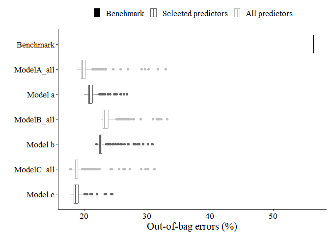<!-- -->

## Display the results: train and test in monitored reaches

Here we split again the dataset into training and testing sets, runs
predictions using the final random forest models, and prepares the data
for visualization. It then plots observed and predicted water condition
classes along the river length for both training and testing periods,
with facets showing monthly variations in the sections.

### Model a

``` r
# Split the dataset into training (75%) and testing (25%) subsets
set.seed(100)
index <- createDataPartition(data_obs_Sent[,5], p=0.75, list=FALSE)

# Define predictor variables (spectral indices, etc.)
x_train_a <- data_obs_Sent[index, -c(1:6)]
x_test_a  <- data_obs_Sent[-index, -c(1:6)]

# Define response variable (observed water condition)
y_train_a <- as.factor(data_obs_Sent[index, 5])
y_test_a  <- as.factor(data_obs_Sent[-index, 5])

# Rename the 5th column to "obs" to indicate observed values
colnames(data_obs_Sent)[5] <- "obs"

# Prepare training data for visualization
train_plot <- data_obs_Sent[index, ]
train_plot$pred <- rf_selSent5x$predicted   # Add model predictions to the training data


# Reshape data into long format for plotting ("obs" vs "pred")
train_plot <- melt(train_plot[, -c(1,6,10)], measure.vars = c("obs", "pred"))

# Make predictions on the test set using the random forest model
set.seed(100)
predictions <- predict(rf_selSent5x, x_test_a)

# Combine test features with observed and predicted values
result <- x_test_a
result['obs']  <- y_test_a
result['pred'] <- predictions

# Evaluate model performance using a confusion matrix
confusionMatrix(predictions, y_test_a, positive = "Wet")
```

    ## Confusion Matrix and Statistics
    ## 
    ##            Reference
    ## Prediction  Dry NotDet Partially Wet
    ##   Dry        68     12         1   2
    ##   NotDet     10     26         1   1
    ##   Partially   1      0         0   0
    ##   Wet         1      2         0  24
    ## 
    ## Overall Statistics
    ##                                          
    ##                Accuracy : 0.7919         
    ##                  95% CI : (0.7179, 0.854)
    ##     No Information Rate : 0.5369         
    ##     P-Value [Acc > NIR] : 8.173e-11      
    ##                                          
    ##                   Kappa : 0.653          
    ##                                          
    ##  Mcnemar's Test P-Value : NA             
    ## 
    ## Statistics by Class:
    ## 
    ##                      Class: Dry Class: NotDet Class: Partially Class: Wet
    ## Sensitivity              0.8500        0.6500         0.000000     0.8889
    ## Specificity              0.7826        0.8899         0.993197     0.9754
    ## Pos Pred Value           0.8193        0.6842         0.000000     0.8889
    ## Neg Pred Value           0.8182        0.8739         0.986486     0.9754
    ## Prevalence               0.5369        0.2685         0.013423     0.1812
    ## Detection Rate           0.4564        0.1745         0.000000     0.1611
    ## Detection Prevalence     0.5570        0.2550         0.006711     0.1812
    ## Balanced Accuracy        0.8163        0.7700         0.496599     0.9321

``` r
# Prepare test data for visualization
test_plot <- cbind(data_obs_Sent[-index, -c(1,6,10)], result[, 6:7])

# Reshape test data into long format ("obs" vs "pred")
test_plot <- melt(test_plot, measure.vars = c("obs", "pred"))

# Label dataset partitions (train/test)
test_plot$part  <- "test"
train_plot$part <- "train"

# Combine both datasets into one for comparison
part_plot <- rbind(train_plot, test_plot)
part_plot$part <- factor(part_plot$part, levels = c("train", "test"))

# Format the Month variable for plotting
part_plot$Month <- paste(part_plot$Month, "/2022", sep = "")
part_plot$Month <- factor(part_plot$Month, levels = c("5/2022", "6/2022", "11/2022"))

# Clean and standardize categorical labels
part_plot$value <- gsub("Partially", "Transition", part_plot$value)
part_plot$value <- gsub("NotDet", "Not Determined", part_plot$value)
part_plot$value <- factor(part_plot$value,
                          levels = c("Not Determined", "Dry", "Transition", "Wet"))

head(train_plot)
```

    ##   Units Month Section elev_mean contr_max_km2 Dist_fromLast SENTmndwi_mean
    ## 1 26450     6      BN    564.83      117.7163      2336.451     -0.2961109
    ## 2 26500     6      BN    564.58      117.7284      2369.916     -0.2925577
    ## 3 26550     6      BN    564.74      117.7900      2409.621     -0.2737629
    ## 4 26600     6      BN    565.15      117.7931      2454.105     -0.2624165
    ## 5 26650     6      BN    564.02      117.8050      2503.242     -0.2506984
    ## 6 26700     6      BN    562.77      117.8092         0.000     -0.1636074
    ##   variable value  part
    ## 1      obs   Dry train
    ## 2      obs   Dry train
    ## 3      obs   Dry train
    ## 4      obs   Dry train
    ## 5      obs   Dry train
    ## 6      obs   Wet train

``` r
head(test_plot)
```

    ##   Units Month Section elev_mean contr_max_km2 Dist_fromLast SENTmndwi_mean
    ## 1 26750     6      BN    562.90      117.9719        0.0000    -0.06721749
    ## 2 26900     6      BN    564.72      118.1061      133.2142    -0.26370309
    ## 3 27100     6      BN    564.29      118.1164      315.0852    -0.32616087
    ## 4 27450     6      BN    564.50      120.7858      574.2019    -0.33638320
    ## 5 27500     6      BN    564.63      120.7911      534.7151    -0.33230866
    ## 6 27550     6      BN    564.48      120.8606      549.0816    -0.31410044
    ##   variable  value part
    ## 1      obs    Wet test
    ## 2      obs    Dry test
    ## 3      obs    Dry test
    ## 4      obs    Dry test
    ## 5      obs    Dry test
    ## 6      obs NotDet test

Test showing the results for the Aroeira reach with Sentinel model.
Points are colored by class and shaped by dataset (training or testing),
allowing an easy visual comparison of model performance across river
segments and months.

``` r
# Define custom colors for water condition categories
wc_colors <- c("#CA0020", "#F4A582", "#92C5DE", "#1F78B4")

# Create ggplot for the ARO section
p <- part_plot %>%
  filter(Section == "ARO") %>%
  ggplot(aes(x = Units/1000, y = variable, 
             color = value, shape = part, group = part)) + 
        ggtitle("Model a \nDownstream reach") +
        geom_point(position = position_dodge(width = 0.3)) + 
        labs(x = "River length since the source of the river (km)", 
             y = " ", color = "") +
        scale_color_manual(values = wc_colors) +
        scale_x_continuous(limits = c(85, 89)) +
        facet_grid(Month ~ ., scales = "free") +
        guides(color = guide_legend(reverse = TRUE)) +
        theme_classic() +
        theme(
          legend.position = "top",
          legend.title = element_blank(),
          text = element_text(size = 16, family = "Times"),
          plot.title = element_text(size = 16, face = "bold"),
          legend.text = element_text(size = 14)
        )

# Extract legend separately
legend_2 <- get_legend(p)
```

    ## Warning: Removed 64 rows containing missing values or values outside the scale range
    ## (`geom_point()`).

``` r
# Combine legend and plot
ggarrange(
  legend_2,
  p + theme(legend.position = "none"),
  ncol = 1, nrow = 2,
  heights = c(0.3, 3)
)
```

    ## Warning: Removed 64 rows containing missing values or values outside the scale range
    ## (`geom_point()`).

<!-- -->

The code below generates comparative plots for all river
sections—upstream (BN), middle (BAR), and downstream (ARO). Each panel
shows observed and predicted water condition classes along the river
length, separated by month. The combined figure allows visual assessment
of spatial and temporal patterns in model performance across the full
river reach.

``` r
# Define colors (only three categories are present in this section)
wc_colors <- c("#CA0020", "#F4A582", "#1F78B4")

# Plot for the upstream reach (BN)
u <- part_plot %>%
  filter(Section == "BN") %>%
  ggplot(aes(x = Units/1000, y = variable, color = value, shape = part, group = part)) + 
        ggtitle("Model a \nUpstream reach") +
        geom_point(position = position_dodge(width = 0.3)) + 
        labs(x = " ", y = " ", color = "") +
        scale_color_manual(values = wc_colors) +
        facet_grid(Month ~ ., scales = "free") +
        guides(color = guide_legend(reverse = TRUE)) +
        theme_classic() +
        theme(
          legend.position = "none",
          legend.title = element_blank(),
          text = element_text(size = 16, family = "Times"),
          plot.title = element_text(size = 16, face = "bold"),
          legend.text = element_text(size = 14)
        )

# Define colors again (four categories for middle and downstream reaches)
wc_colors <- c("#CA0020", "#F4A582", "#92C5DE", "#1F78B4")

# Plot for the middle reach (BAR)
m <- part_plot %>%
  filter(Section == "BAR") %>%
  ggplot(aes(x = Units/1000, y = variable, color = value, shape = part, group = part)) + 
        ggtitle("Middle reach") +
        geom_point(position = position_dodge(width = 0.3)) + 
        labs(x = " ", y = " ", color = "") +
        scale_color_manual(values = wc_colors) +
        facet_grid(Month ~ ., scales = "free") +
        guides(color = guide_legend(reverse = TRUE)) +
        theme_classic() +
        theme(
          legend.position = "none",
          legend.title = element_blank(),
          text = element_text(size = 16, family = "Times"),
          plot.title = element_text(size = 16, face = "bold"),
          legend.text = element_text(size = 14)
        )

# Plot for the downstream reach (ARO)
d <- part_plot %>%
  filter(Section == "ARO") %>%
  ggplot(aes(x = Units/1000, y = variable, color = value, shape = part, group = part)) + 
        ggtitle("Downstream reach") +
        geom_point(position = position_dodge(width = 0.3)) + 
        labs(x = "River length since the source of the river (km)", y = " ", color = "") +
        scale_color_manual(values = wc_colors) +
        facet_grid(Month ~ ., scales = "free") +
        guides(color = guide_legend(reverse = TRUE)) +
        theme_classic() +
        theme(
          legend.position = "top",
          legend.title = element_blank(),
          text = element_text(size = 16, family = "Times"),
          plot.title = element_text(size = 16, face = "bold"),
          legend.text = element_text(size = 14)
        )

# Extract legend from the downstream plot
legend_2 <- get_legend(d)

# Combine all plots and the legend into a single figure
ggarrange(
   legend_2, u, m, d + theme(legend.position = "none"),
   ncol = 1, nrow = 4, 
   heights = c(0.5, 3, 4, 5)
)
```

<!-- -->

### Model b

The code below prepares the data for Model b following the same
procedure used for Model a. The dataset is split into training and
testing sets, predictions are generated using the corresponding random
forest model, and both observed and predicted classes are combined for
visualization. The processed data will later be used to compare spatial
and temporal patterns of predicted water conditions across the river
sections.

``` r
set.seed(100)

# Split Model B dataset (data_obs_PS) into training (75%) and testing (25%)
index <- createDataPartition(data_obs_PS[,5], p = 0.75, list = FALSE)

x_train_b <- data_obs_PS[index, -c(1:6)]
x_test_b  <- data_obs_PS[-index, -c(1:6)]

y_train_b <- as.factor(data_obs_PS[index, 5])
y_test_b  <- as.factor(data_obs_PS[-index, 5])

# obs column
colnames(data_obs_PS)[5] <- "obs"

# Training data
train_plot <- data_obs_PS[index, ]
train_plot$pred <- rf_PS5x$predicted


train_plot <- melt(train_plot[,-c(1,6)], measure.vars = c("obs", "pred"))

# Testing data
set.seed(100)
predictions <- predict(rf_PS5x, x_test_b)

result <- x_test_b
result['obs']  <- y_test_b
result['pred'] <- predictions

test_plot <- cbind(data_obs_PS[-index, -c(1,6)], result[, 6:7])
test_plot <- melt(test_plot, measure.vars = c("obs", "pred"))

# Combine training and testing sets
test_plot$part  <- "test"
train_plot$part <- "train"

part_plot <- rbind(train_plot, test_plot) 
part_plot$part <- factor(part_plot$part, levels = c("train", "test"))

# Format variables for visualization 
part_plot$Month <- paste(part_plot$Month, "/2022", sep = "")
part_plot$Month <- factor(part_plot$Month, levels = c("4/2022", "5/2022", "6/2022", "11/2022"))

part_plot$value <- gsub("Partially", "Transition", part_plot$value)
part_plot$value <- gsub("NotDet", "Not Determined", part_plot$value)
part_plot$value <- factor(part_plot$value, 
                          levels = c("Not Determined", "Dry", "Transition", "Wet"))
```

``` r
# Define colors again (four categories)
wc_colors <- c("#CA0020", "#F4A582", "#92C5DE", "#1F78B4")

# Upstream reach (BN)
u <- part_plot %>%
  filter(Section == "BN") %>%
  ggplot(aes(x = Units/1000, y = variable, 
             color = value, shape = part, group = part)) + 
        ggtitle("Model b \nUpstream reach") +
        geom_point(position = position_dodge(width = 0.3)) + 
        labs(x = " ", y = " ", color = "") +
        scale_color_manual(values = wc_colors) +
        facet_grid(Month ~ ., scales = "free") +
        guides(color = guide_legend(reverse = TRUE)) +
        theme_classic() +
        theme(
          legend.position = "none",
          legend.title = element_blank(),
          text = element_text(size = 16, family = "Times"),
          plot.title = element_text(size = 16, face = "bold"),
          legend.text = element_text(size = 14)
        )

# Middle reach (BAR)
m <- part_plot %>%
  filter(Section == "BAR") %>%
  ggplot(aes(x = Units/1000, y = variable, 
             color = value, shape = part, group = part)) + 
        ggtitle("Middle reach") +
        geom_point(position = position_dodge(width = 0.3)) + 
        labs(x = " ", y = " ", color = "") +
        scale_color_manual(values = wc_colors) +
        facet_grid(Month ~ ., scales = "free") +
        guides(color = guide_legend(reverse = TRUE)) +
        theme_classic() +
        theme(
          legend.position = "none",
          legend.title = element_blank(),
          text = element_text(size = 16, family = "Times"),
          plot.title = element_text(size = 16, face = "bold"),
          legend.text = element_text(size = 14)
        )

# Downstream reach (ARO)
d <- part_plot %>%
  filter(Section == "ARO") %>%
  ggplot(aes(x = Units/1000, y = variable, 
             color = value, shape = part, group = part)) + 
        ggtitle("Downstream reach") +
        geom_point(position = position_dodge(width = 0.3)) + 
        labs(x = "River length since the source of the river (km)", 
             y = " ", color = "") +
        scale_color_manual(values = wc_colors) +
        facet_grid(Month ~ ., scales = "free") +
        guides(color = guide_legend(reverse = TRUE)) +
        theme_classic() +
        theme(
          legend.position = "top",
          legend.title = element_blank(),
          text = element_text(size = 16, family = "Times"),
          plot.title = element_text(size = 16, face = "bold"),
          legend.text = element_text(size = 14)
        )

# Extract legend from downstream plot
legend_2 <- get_legend(d)

# Combine all plots vertically with shared legend
ggarrange(
  legend_2, u, m, d + theme(legend.position = "none"),
  ncol = 1, nrow = 4,
  heights = c(0.5, 4, 4, 5)
)
```

<!-- -->

### Model c

The code below applies the same workflow to Model C, using all
drone-based data and only precipitation as dynamic difference. It
combines observed and predicted water condition classes for both
training and testing datasets, formats them for visualization, and
generates plots for the upstream (BN), middle (BAR), and downstream
(ARO) river sections. February 2022 data are excluded from the middle
reach due to incomplete observations.

``` r
set.seed(100)

# Split Model c dataset (data_obs_UAV) into training (75%) and testing (25%)
index <- createDataPartition(data_obs_UAV[,5], p=0.75, list=FALSE)

x_train_c <- data_obs_UAV[index,-c(1:6)]
x_test_c <- data_obs_UAV[-index,-c(1:6)]

y_train_c <- as.factor(data_obs_UAV[index,5])
y_test_c <- as.factor(data_obs_UAV[-index,5])

# obs column
colnames(data_obs_UAV)[5] <- "obs"

# Training data
train_plot <- data_obs_UAV[index, ]
train_plot$pred <- rf_Drone5x$predicted

train_plot <- melt(train_plot[, -c(1,6)], measure.vars = c("obs", "pred"))

# Testing data
set.seed(100)
predictions <- predict(rf_Drone5x, x_test_c)

result <- x_test_c
result['obs']  <- y_test_c
result['pred'] <- predictions

test_plot <- cbind(data_obs_UAV[-index, -c(1,6)], result[, 6:7])
test_plot <- melt(test_plot, measure.vars = c("obs", "pred"))

# Combine training and testing sets
test_plot$part  <- "test"
train_plot$part <- "train"

part_plot <- rbind(train_plot, test_plot)
part_plot$part <- factor(part_plot$part, levels = c("train", "test"))

# Format variables for visualization
part_plot$Month <- paste(part_plot$Month, "/2022", sep = "")
part_plot$Month <- factor(part_plot$Month, 
                          levels = c("2/2022", "3/2022", "4/2022", "5/2022", "6/2022", "11/2022"))

part_plot$value <- gsub("Partially", "Transition", part_plot$value)
part_plot$value <- gsub("NotDet", "Not Determined", part_plot$value)
part_plot$value <- factor(part_plot$value, 
                          levels = c("Not Determined", "Dry", "Transition", "Wet"))
```

``` r
# Define colors again (four categories)
wc_colors <- c("#CA0020", "#F4A582", "#92C5DE", "#1F78B4")

# Upstream reach (BN)
u <- part_plot %>%
  filter(Section == "BN") %>%
  ggplot(aes(x = Units/1000, y = variable, 
             color = value, shape = part, group = part)) + 
        ggtitle("Model c \nUpstream reach") +
        geom_point(position = position_dodge(width = 0.3)) + 
        labs(x = " ", y = " ", color = "") +
        scale_color_manual(values = wc_colors) +
        facet_grid(Month ~ ., scales = "free") +
        guides(color = guide_legend(reverse = TRUE)) +
        theme_classic() +
        theme(
          legend.position = "none",
          legend.title = element_blank(),
          text = element_text(size = 16, family = "Times"),
          plot.title = element_text(size = 16, face = "bold"),
          legend.text = element_text(size = 14)
        )

# Middle reach (BAR) — February 2022 removed due to inconsistent data
m <- part_plot %>%
  filter(Section == "BAR") %>%
  filter(Month != "2/2022") %>%
  ggplot(aes(x = Units/1000, y = variable, 
             color = value, shape = part, group = part)) + 
        ggtitle("Middle reach") +
        geom_point(position = position_dodge(width = 0.3)) + 
        labs(x = " ", y = " ", color = "") +
        scale_color_manual(values = wc_colors) +
        facet_grid(Month ~ ., scales = "free") +
        guides(color = guide_legend(reverse = TRUE)) +
        theme_classic() +
        theme(
          legend.position = "none",
          legend.title = element_blank(),
          text = element_text(size = 16, family = "Times"),
          plot.title = element_text(size = 16, face = "bold"),
          legend.text = element_text(size = 14)
        )

# Downstream reach (ARO)
d <- part_plot %>%
  filter(Section == "ARO") %>%
  ggplot(aes(x = Units/1000, y = variable, 
             color = value, shape = part, group = part)) + 
        ggtitle("Downstream reach") +
        geom_point(position = position_dodge(width = 0.3)) + 
        labs(x = "River length since the source of the river (km)", 
             y = " ", color = "") +
        scale_color_manual(values = wc_colors) +
        facet_grid(Month ~ ., scales = "free") +
        guides(color = guide_legend(reverse = TRUE)) +
        theme_classic() +
        theme(
          legend.position = "top",
          legend.title = element_blank(),
          text = element_text(size = 16, family = "Times"),
          plot.title = element_text(size = 16, face = "bold"),
          legend.text = element_text(size = 14)
        )

# Extract legend and combine plots into a single figure
legend_2 <- get_legend(d)

ggarrange(
  legend_2, u, m, d + theme(legend.position = "none"),
  ncol = 1, nrow = 4,
  heights = c(0.5, 4, 4, 5)
)
```

<!-- -->

## Temporal evaluation: apply models to all avaliable dates for the whole river

### Model a

After loading the input dataset, we clean it to retain only complete
cases, make predictions for water condition classes along the river, and
save the results. Finally, we visualize the temporal distribution of
predicted classes over the year 2022 as proportions per date.

``` r
# Load and clean input data
input <- read.csv("Input/Umb_all_input_SENTmndwi.csv")
input$date <- as.Date(input$date, format="%d/%m/%Y")
river_test <- input[complete.cases(input),]


# Predict using the Random Forest model
set.seed(99)
predictions_river <- predict(rf_selSent5x, river_test[,-c(1:2)])
result_river <- river_test
result_river['predicted'] <-  predictions_river

# Format for plotting
result_river$date <- as.Date(result_river$date)
result_river$predicted <- sub("Partially", "Transition", result_river$predicted)
result_river$predicted <- sub("NotDet", "Not Determined", result_river$predicted)
result_river$predicted <- factor(result_river$predicted, levels = c('Not Determined',"Dry","Transition", "Wet"))

# Plot temporal distribution of predicted classes
wc_colors <- c("#CA0020","#F4A582","#92C5DE","#1F78B4")
st <- result_river %>%
  group_by(date,predicted) %>%
  summarise(n = n()) %>%
  mutate(freq=n/sum(n)*100) %>%
  ggplot(aes(x=date, y=freq, fill=predicted))+
  geom_col()+
  scale_fill_manual(values = wc_colors)+
  scale_x_date(breaks = "1 month", date_labels = '%b', 
               limits = as.Date(c("2022-01-01","2022-12-31")))+
  ylab("Proportion (%)")+xlab("")+
  theme_classic()
```

    ## `summarise()` has grouped output by 'date'. You can override using the
    ## `.groups` argument.

``` r
st
```

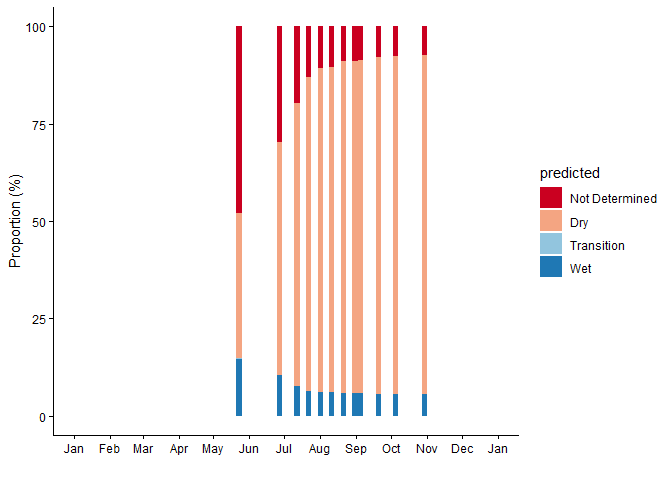<!-- -->

### Model b

Here we do that same for model b, and apply the trained model to the
full river dataset. After loading and cleaning the input data, we
generate predictions for water condition classes along the river. The
predicted classes are then formatted and visualized as proportions over
the year 2022 for all available dates.

``` r
# Load and clean input data
input <- read.csv("Input/Umb_all_input_PSndvi.csv")
colnames(input)[3] <- "date"
input$date <- as.Date(input$date)
river_test <- input[complete.cases(input),]

# Load trained model
#load("rf_selPS5.RData")

# Predict using the Random Forest model
set.seed(99)
predictions_river <- predict(rf_PS5x, river_test[,-c(1:3,9)])
result_riverPS <- river_test
result_riverPS['predicted'] <-  predictions_river

# Format predicted classes
result_riverPS$date <- as.Date(result_riverPS$date)
result_riverPS$predicted <- sub("Partially", "Transition", result_riverPS$predicted)
result_riverPS$predicted <- sub("NotDet", "Not Determined", result_riverPS$predicted)
result_riverPS$predicted <- factor(result_riverPS$predicted, 
                                   levels = c('Not Determined',"Dry","Transition", "Wet"))

# Plot temporal distribution of predicted classes
wc_colors <- c("#CA0020","#F4A582","#92C5DE","#1F78B4")
ps <- result_riverPS %>%
  group_by(date,predicted) %>%
  summarise(n = n()) %>%
  mutate(freq=n/sum(n)*100) %>%
  ggplot(aes(x=date, y=freq, fill=predicted))+
  geom_col()+
  scale_fill_manual(values = wc_colors)+
  scale_x_date(breaks = "1 month", date_labels = '%b', 
               limits = as.Date(c("2022-01-01","2022-12-31")))+
  ylab("Proportion (%)")+xlab("")+
  theme_classic()
```

    ## `summarise()` has grouped output by 'date'. You can override using the
    ## `.groups` argument.

``` r
ps
```

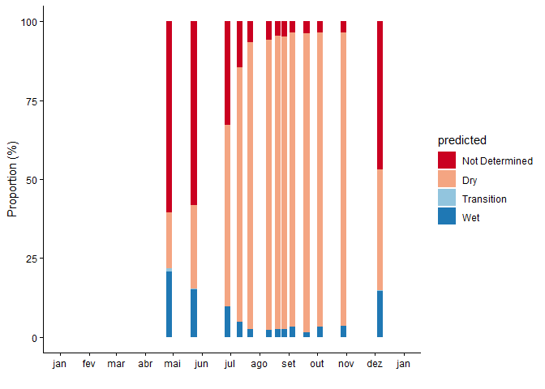<!-- -->

### Model c

Same for model c, we load and clen the input data, we generate
predictions for water condition classes along the river. The predicted
classes are then formatted and visualized as proportions over the year
2022 for all available dates.

``` r
# Load and clean input data
input <-  readRDS('Input/Umb_all_input_api30.rds')
input$date <- as.Date(input$date)
river_test <- input[complete.cases(input),]

# Predict using the Random Forest model
predictions_river <- predict(rf_Drone5x, river_test[,-c(1:2)])
result_riverDr <- river_test
result_riverDr$predicted <- predictions_river

# Format predicted classes
result_riverDr$date <- as.Date(result_riverDr$date)
result_riverDr$predicted <- sub("Partially", "Transition", result_riverDr$predicted)
result_riverDr$predicted <- sub("NotDet", "Not Determined", result_riverDr$predicted)
result_riverDr$predicted <- factor(result_riverDr$predicted, levels = c('Not Determined',"Dry","Transition", "Wet"))

# Plot temporal distribution of predicted classes
wc_colors <- c("#CA0020","#F4A582","#92C5DE","#1F78B4")
dr <- result_riverDr %>%
  group_by(date,predicted) %>%
  summarise(n = n()) %>%
  mutate(freq = n/sum(n)*100) %>%
  ggplot(aes(x = date, y = freq, fill = predicted))+
  geom_col(colour = NA)+
  scale_fill_manual(values = wc_colors)+
  scale_x_date(breaks = "1 month", date_labels = '%b')+
  ylab("Proportion (%)")+ xlab("")+
  theme_classic()
```

    ## `summarise()` has grouped output by 'date'. You can override using the
    ## `.groups` argument.

``` r
dr
```

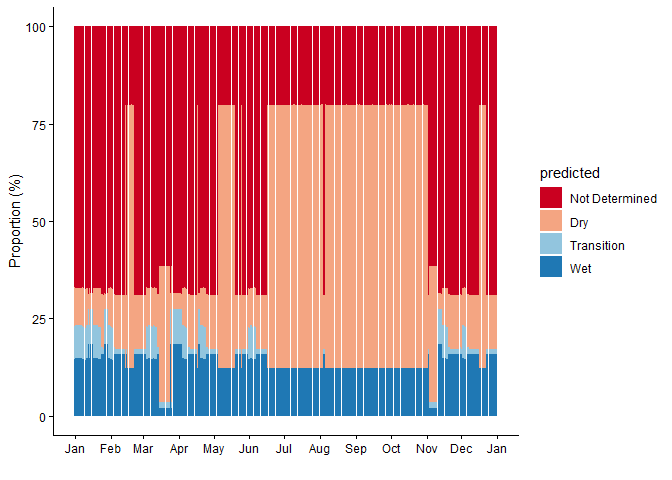<!-- -->

### All models

In this section, we combine the outputs of all three Random Forest
models (Models A, B, and C) with monthly precipitation to visualize how
water conditions along the river relate to rainfall patterns.
Precipitation is represented as a reversed bar plot to visually
highlight months with higher rainfall at the top of the plot. This
layout facilitates comparison between rainfall events and predicted
water conditions along the river.

``` r
# Read the precipitation data
Rain_bea <- read.csv("Input/Rain_bea_2022.csv")
Rain_bea$Date <- as.Date(Rain_bea$Date)

# Only precipitation plot
ppt_only <- Rain_bea %>%
    group_by(month = lubridate::floor_date(Date, "month")) %>%
    dplyr::summarize(rain = sum(EP2)) %>%
    ggplot(aes(month, rain)) +
    geom_col(fill="black") +
    scale_x_date(limits = as.Date(c("2022-01-01", "2022-12-15")),
                 breaks = "1 month", date_labels = '%b') +
    ylab("Precipitation (mm)") + xlab("") +
    theme_classic() +
    theme(axis.text = element_text(size=15, family="serif", colour="black"),
          axis.title.y = element_text(size=15, family="serif", hjust=1, colour="black"))

ppt_only
```

    ## Warning: Removed 1 row containing missing values or values outside the scale range
    ## (`geom_col()`).

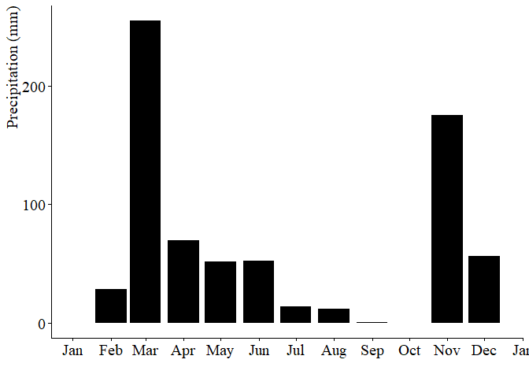<!-- -->

``` r
# Customize model plots: titles, labels, themes
st <- st + labs(title="Model a", y="") +
              guides(fill = guide_legend(reverse = TRUE)) +
              theme(legend.title = element_blank(),
                    text = element_text(size=16, family="Times"),
                    plot.title = element_text(size = 16, face = "bold"),
                    legend.text = element_text(size=14))

ps <- ps + labs(title="Model b") +
              theme(text = element_text(size=16, family="Times"),
                    plot.title = element_text(size = 16, face = "bold"))

dr <- dr + labs(title="Model c", y="") +
              theme(text = element_text(size=16, family="Times"),
                    plot.title = element_text(size = 16, face = "bold"))

# Aggregate precipitation monthly
ppt <- Rain_bea %>%
    group_by(month = lubridate::floor_date(Date, "month")) %>%
    dplyr::summarize(rain = sum(EP2)) %>%
    ggplot(aes(month, rain)) +
    geom_col(fill="black") +
    scale_x_date(limits = as.Date(c("2022-01-01", "2022-12-31")), 
                 breaks = "1 month", date_labels = '%b', position = "top") +
    scale_y_reverse() +  # Reverse y-axis to place high rainfall at top
    ylab("Precipitation (mm)") + xlab("") +
    theme_classic() +
    theme(text = element_text(size=16, family="Times"))

# Combine precipitation and model plots vertically
ggarrange(ppt, st, ps, dr, nrow = 4, common.legend = TRUE)
```

    ## Warning: Removed 1 row containing missing values or values outside the scale range
    ## (`geom_col()`).
    ## Removed 1 row containing missing values or values outside the scale range
    ## (`geom_col()`).

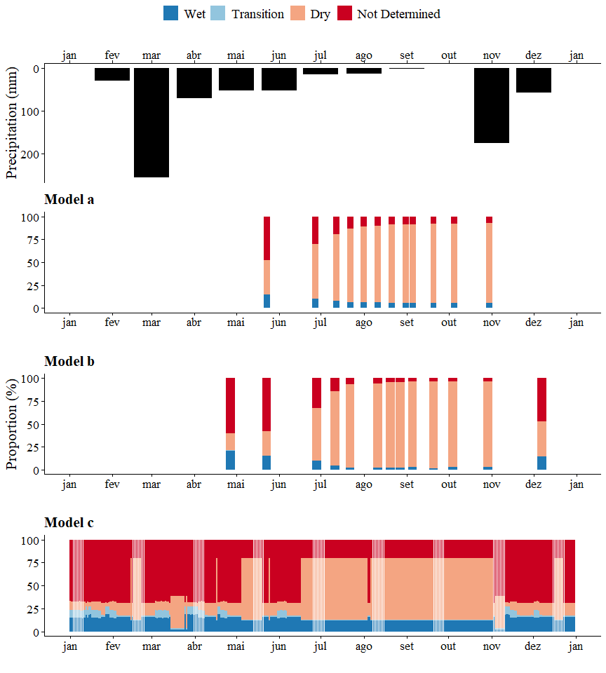<!-- -->
\## Spatiotemporal evaluation of predicted water conditions

To better visualize the spatial variability captured by each model, the
classified results were mapped across the entire river network. These
maps display the predicted surface conditions along the riverbed for
each available date. The visualization highlights spatial patterns in
water presence and transitions over time, providing an integrated view
of the temporal and spatial dynamics represented by each model. Because
Model C includes daily predictions throughout the year, plotting its
results directly on the river shapefile would obscure temporal
variation.

### Model a

``` r
# Load shapefile and convert to sf object
Umb <- shapefile("Input/Umb_distDams.shp") %>% 
  sf::st_as_sf(crs = 4326)

# Merge model predictions with the shapefile
Umb_pred <- merge(Umb, result_river, by.x = "CNGMETER_C", by.y = "Units")

# Define color palette (same as before)
wc_colors <- c("#CA0020","#F4A582","#92C5DE","#1F78B4")

# Plot spatial distribution of predicted classes per date
ggplot(Umb_pred) +
   geom_sf(aes(fill=predicted, color=predicted),linewidth=1.5) +
   facet_wrap(~date, ncol = 2) +
   scale_fill_manual(values = wc_colors, drop = FALSE) +
   scale_color_manual(values = wc_colors, drop = FALSE) +
   ggtitle("Model a – Spatial distribution of predicted water conditions") +
   guides(color = "none",   # Remove duplicate color legend
           fill = guide_legend(override.aes = list(color = NA))  
           # remove border in legend
           ) +
  theme_bw(base_size = 16) +
  theme(
    legend.position = "bottom",
    legend.title = element_blank(),
    axis.text = element_blank(),
    axis.ticks = element_blank(),
    axis.title = element_blank(),
    strip.background = element_rect(fill = "white", 
                                    color = "black"),
    panel.grid = element_blank(),
    text=element_text(size= 16, family= "Times")
  )
```

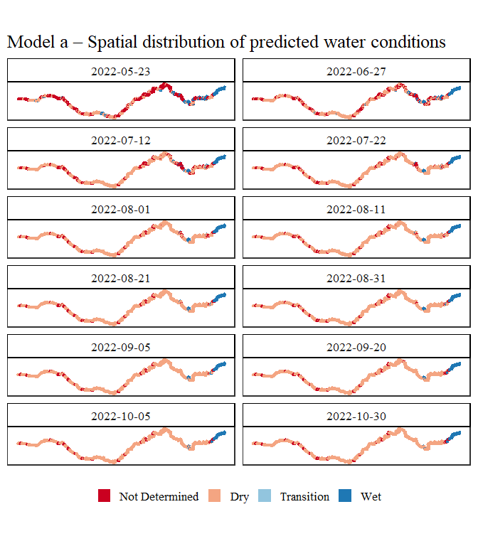<!-- -->

### Model b

``` r
# Merge predictions with river shapefile
Umb_predPS <- merge(
  x = Umb,
  y = result_riverPS,
  by.x = "CNGMETER_C",
  by.y = "Units"
)

# Define colors consistent with other models
wc_colors <- c("#CA0020", "#F4A582", "#92C5DE", "#1F78B4")

# Plot classified results for each available date
ggplot(Umb_predPS) +
  geom_sf(aes(fill=predicted, color=predicted),linewidth=1.5) +
  facet_wrap(~date, ncol = 2) +
  scale_fill_manual(values = wc_colors, drop = FALSE) +
  scale_color_manual(values = wc_colors, drop = FALSE) +
  ggtitle("Model b – Spatial distribution of predicted water conditions") +
  guides(color = "none",   # Remove duplicate color legend
           fill = guide_legend(override.aes = list(color = NA))  
           # remove border in legend
           ) +
  theme_bw(base_size = 16) +
  theme(
    legend.position = "bottom",
    legend.title = element_blank(),
    axis.text = element_blank(),
    axis.ticks = element_blank(),
    axis.title = element_blank(),
    strip.background = element_rect(fill = "white", 
                                    color = "black"),
    panel.grid = element_blank(),
    text = element_text(size = 16, family = "Times")
  )
```

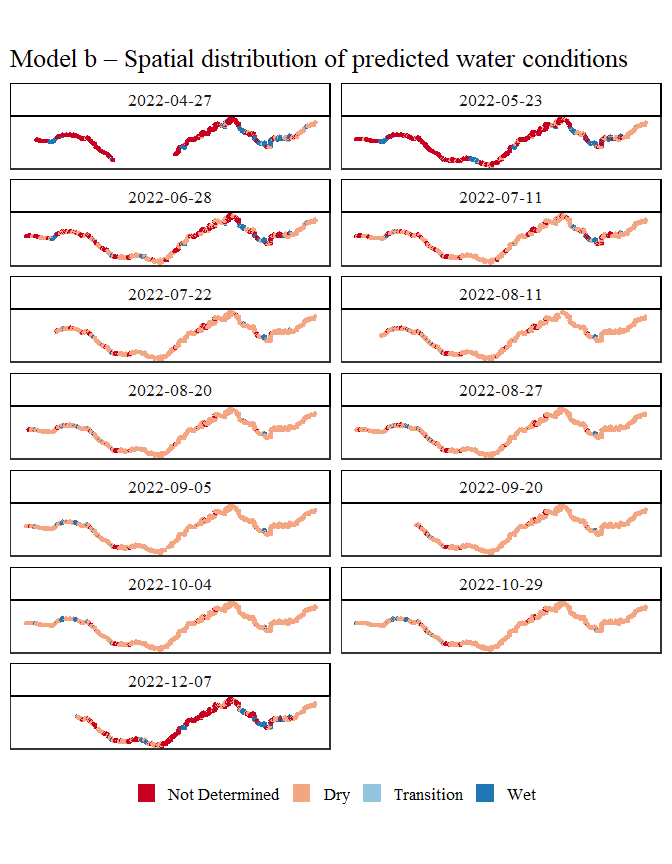<!-- -->

## Heatmaps of water condition along the river

To visualize the temporal evolution of predicted water conditions along
the river, the results from all models were summarized in heatmaps
showing river length on the x-axis and time on the y-axis. This
representation highlights both spatial and seasonal patterns of water
presence and absence.

``` r
library(scales)

#Function to revert dates in the axis
reverse2_trans <- function() {
  trans_new(
    "reverse2",
    function(x) -1 * as.numeric(x), # Force values to be numeric for Date objects
    function(x) -1 * as.numeric(x)
  )
}
```

``` r
# Define color palette
wc_colors <- c("#CA0020", "#F4A582", "#92C5DE", "#1F78B4")

# Prepare and combine data 
result_river$model <- "Model a"
result_riverPS$model <- "Model b"
result_riverDr$model <- "Model c"

heat_all <- bind_rows(
  result_river[, c("Units", "date", "predicted", "model")],
  result_riverPS[, c("Units", "date", "predicted", "model")],
  result_riverDr[, c("Units", "date", "predicted", "model")]
)

heat_all$Units_km <- heat_all$Units / 1000

# Plot 
ggplot(heat_all, aes(x = Units_km, y = date, fill = predicted)) +
  geom_tile(color = NA) +
  scale_fill_manual(values = wc_colors, drop = FALSE) +
  scale_y_continuous(trans = c("date", "reverse2"))+
  facet_grid(model ~ ., scales = "free_y", switch = "y") +
  labs(
    title = "Spatiotemporal distribution of predicted river conditions",
    x = "River length (km)",
    y = "",
    fill = "Predicted class"
  ) +
  theme_classic(base_size = 16) +
  theme(
    text = element_text(size = 16, family = "Times"),
    legend.position = "bottom",
    legend.title = element_blank(),
    legend.text = element_text(size = 12),
    strip.background = element_rect(fill = "white", 
                                    color = "black"),
    strip.text.y = element_text(size = 14, face = "bold"),
    axis.text.x = element_text(angle = 45, hjust = 1)
  )
```

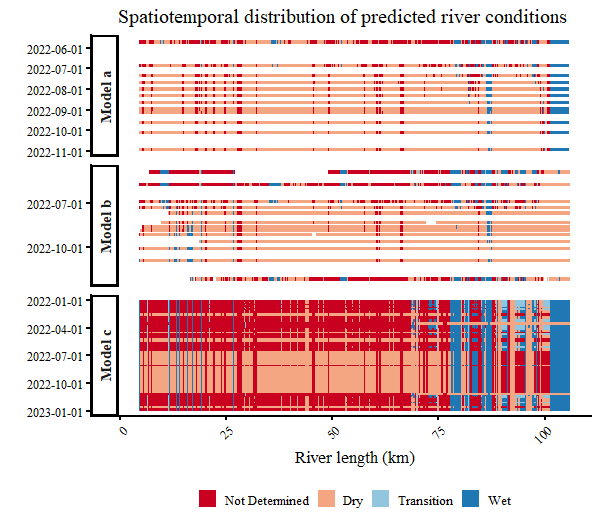<!-- -->

## Spatial evaluation: Water in the riverbed

This section evaluates the spatial distribution of water in the riverbed
along the Umbuzeiro River using the outputs from the three models (A, B,
C). For each model, we counted the number of days in 2022 where each
river segment was classified as ‘Wet’ or ‘Transition’ and merged these
counts into a single table (ndays_todos) for subsequent analysis.

``` r
compute_ndays <- function(result, model_name) {
  ndays <- result %>%
    filter(predicted %in% c("Wet","Transition")) %>%
    group_by(Units) %>%
    summarise(n = n())
  
  result_merge <- merge(result, ndays, by="Units", all.x=T)
  #result_merge$model <- model_name
  result_merge$n[is.na(result_merge$n)] <- 0
  return(result_merge)
}

ndays_drone <- compute_ndays(result_riverDr, "Model c")
ndays_sent  <- compute_ndays(result_river, "Model a")
ndays_ps    <- compute_ndays(result_riverPS, "Model b")

ndays_todos <- rbind(ndays_drone[,c("Units","model", "n")],
                     ndays_sent[,c("Units","model", "n")],
                     ndays_ps[,c("Units","model", "n")])
```

For each river segment, we calculate the percentage of days with water
presence (WIR) with model-specific normalization: Because each model has
a different temporal resolution, we standardize the counts of days with
water presence (n) into percentages:

- Model A (Sentinel-2): divide by 12 (12 monthly images in 2022).

- Model B (PlanetScope): divide by 13 (13 dates available in 2022).

- Model C (Precipitation): divide by 365 days (daily data).

The resulting percentages are mapped along the river using `geom_sf()`,
with a continuous blue gradient indicating higher water presence.

Dam locations are overlaid as red crosses to provide context on how
infrastructure may influence water persistence.

``` r
# Load shapefile and merge with ndays_todos table
Umb <- shapefile("Input/Umb_distDams.shp")
Umbsf <- Umb %>% sf::st_as_sf(crs = 4326)
Umb_ndays <- merge(x = Umbsf, y = ndays_todos, by.x = "CNGMETER_C", by.y = "Units")

# Compute percentage of days with water for each model
ndays_perc <- ndays_todos %>% 
  mutate(perc = case_when(
    model == "Model c" ~ n/365,
    model == "Model b" ~ n/13,
    model == "Model a" ~ n/12,
    TRUE ~ NA_real_))  # default if model unknown

# Merge percentages with river shapefile
Umb_perc <- merge(x = Umbsf, y = ndays_perc, by.x = "CNGMETER_C", by.y = "Units")

# Plot spatial distribution with dam locations and facet by model
ggplot(Umb_perc) +
  geom_sf(aes(fill=perc, color=perc),linewidth=1.5) + # river segments colored by % days with water
  scale_fill_continuous( 
        high = "darkblue",
        low = "lightgrey", 
        name = "Percentage of days \n with water in \n the riverbed (WIR)",
        labels = scales::label_percent(scale = 100)
       )+
  scale_color_continuous( 
        high = "darkblue",
        low = "lightgrey",
        name = "Percentage of days \n with water in \n the riverbed (WIR)",
        labels = scales::label_percent(scale = 100)
       )+
  geom_point(data=Umb_ndays[which(Umb_ndays$Dam != 0),], # overlay dam locations
    aes(geometry = geometry, colour="Dam location"),
    stat = "sf_coordinates", shape=4, size=1.5,color="red")+
  facet_grid(model~., switch="both")+ # separate plots per model
  theme_bw(base_size = 18) +
  theme(strip.background = element_rect(fill = "white", colour = "black"),
        panel.grid = element_blank(),
        legend.position = "right",
        legend.title = element_text(),
        legend.spacing.y = unit(0.2, 'cm'),
        axis.text = element_blank(),
        axis.ticks = element_blank(),
        axis.line= element_blank(),
        axis.title = element_blank(),
        text=element_text(size= 16, family= "Times"))
```

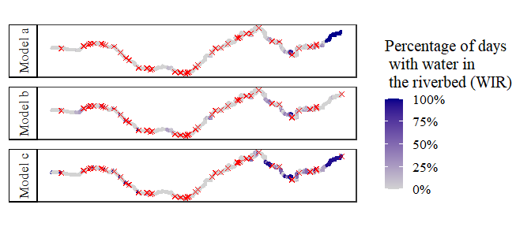<!-- -->
